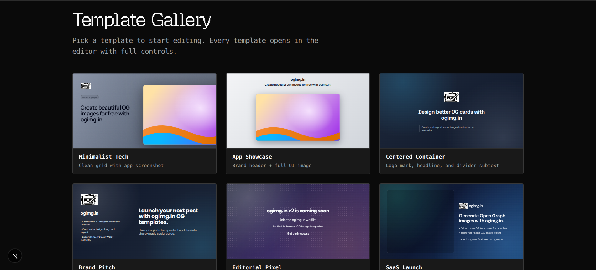
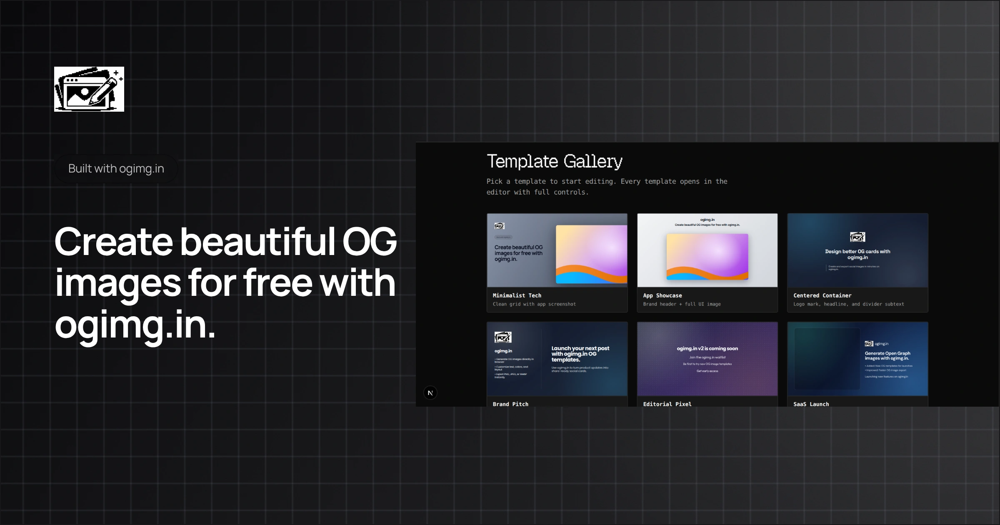
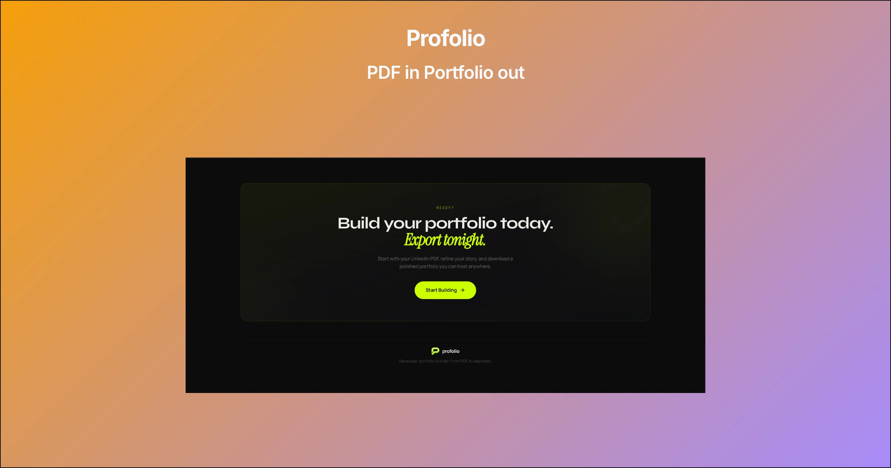
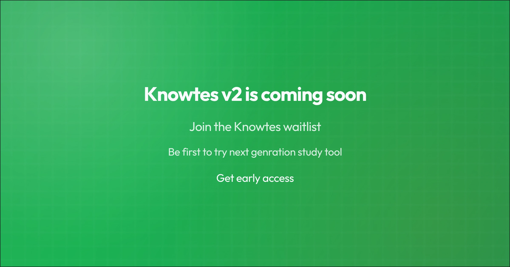
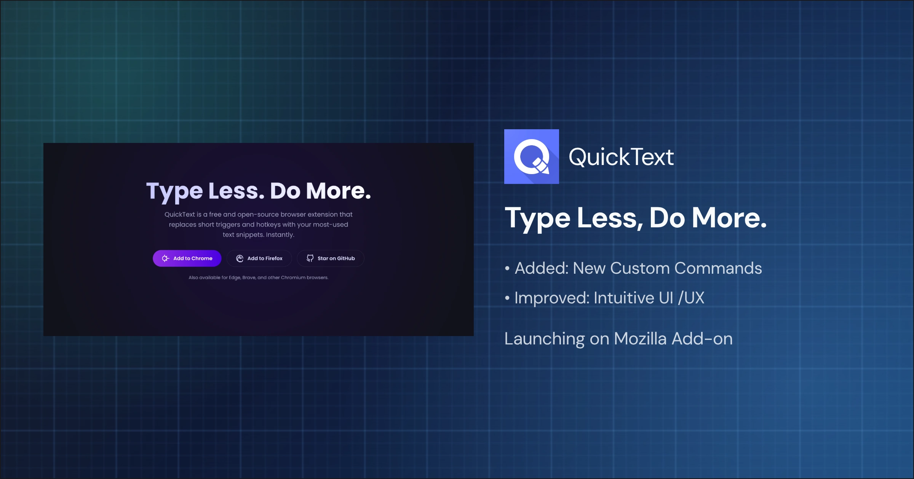
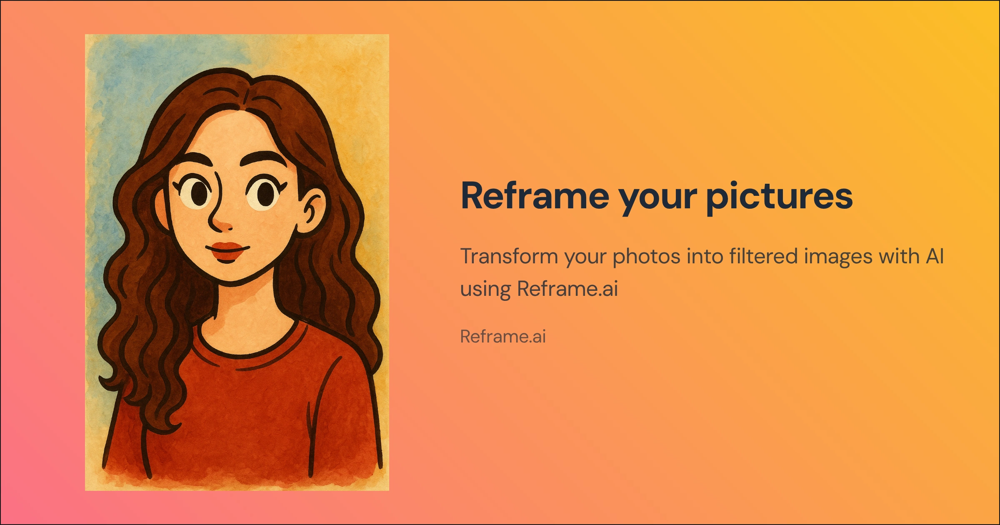
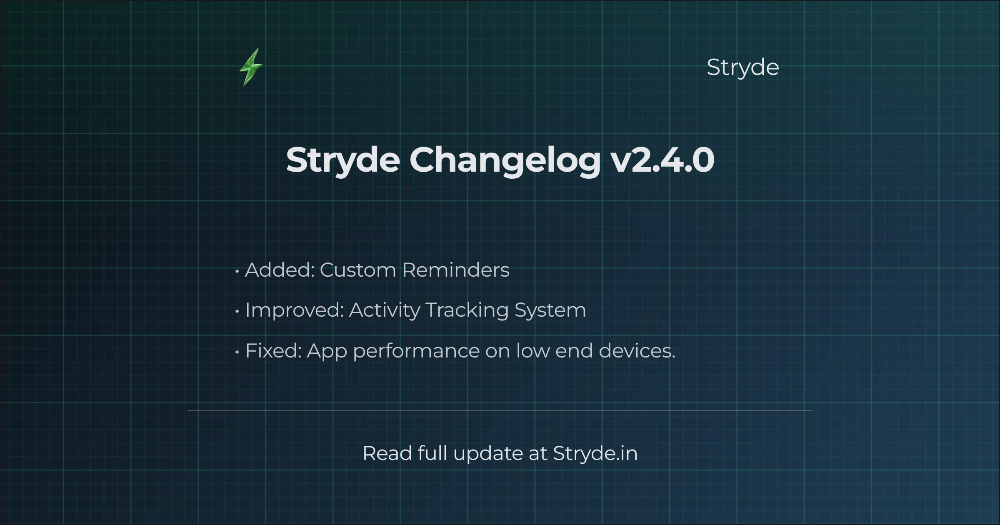

<p align="center">
  
</p>

<h1 align="center">ogimg.in</h1>

<p align="center">
  Generate beautiful Open Graph images in your browser.
</p>

<p align="center">
  A fast, template-driven OG image generator built with Next.js.
</p>

<p align="center">
  
  
  
  
  
  <a href="./LICENSE"></a>
</p>


## About
`ogimg.in` helps you generate social preview images (Open Graph / Twitter) quickly without opening a design tool.

The app gives you curated templates, inline editing, and instant export-ready visuals so you can ship links with strong previews faster.

## Why This Exists
- Social previews heavily impact CTR and first impression.
- Designers should not be a bottleneck for every new page/post.
- Teams need consistency across docs, launches, changelogs, and blog articles.

## Features
- Curated template gallery optimized for OG dimensions
- Browser-based editing workflow
- One-click export flow for social cards
- Scroll showcase section for output presentation
- Responsive landing page and editor experience
- Zero backend dependency for core visual editing flow

## Output Previews
<p align="center">
  
</p>

<table align="center">
  <tr>
    <td></td>
    <td></td>
    <td></td>
  </tr>
  <tr>
    <td></td>
    <td></td>
    <td></td>
  </tr>
  <tr>
    <td></td>
    <td></td>
    <td></td>
  </tr>
</table>

## Use Cases
- Blog post OG images
- Product launch link previews
- Changelog and release announcement cards
- Docs and developer tooling pages
- Portfolio/project social cards

## Tech Stack
- Next.js 16 (App Router)
- React 19
- TypeScript 5
- Tailwind CSS 4
- Framer Motion
- Phosphor Icons

## Getting Started
```bash
npm install
npm run dev
```

Open `http://localhost:3000` in your browser.

## Project Structure
```text
app/
  components/
  editor/[templateId]/
  template-gallery/
  page.tsx
public/
  1.webp ... 9.webp
  ogimg.png
```

## Scripts
- `npm run dev` - start local development server
- `npm run build` - create production build
- `npm run start` - run production build locally
- `npm run lint` - run ESLint

## Contributing
Issues and pull requests are welcome. For larger changes, open an issue first with scope and screenshots.

## License
Licensed under the [MIT License](./LICENSE).
